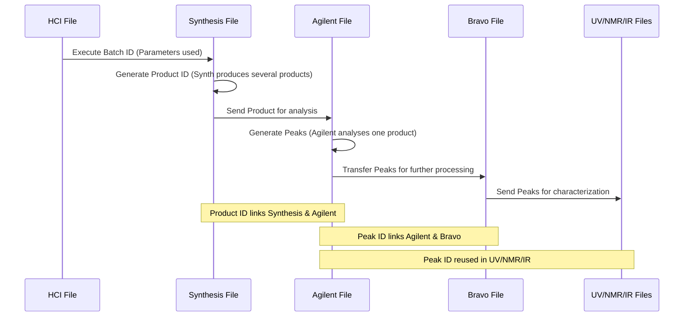

# Data Linkage

The ontology conceptualizes numerous concepts spanning various raw data files.The converter processes these many different kinds of raw data files. this sequence diagram aims to help understand the ties between concepts and how files are linked together.

