# Front-end (User Interface)

The Cat+ front-end (UI) is at this repository:

[catplus-chemboard](https://github.com/sdsc-ordes/catplus-chemboard).

## Technology

The frontend uses the following technologies:

- [Sveltekit](https://svelte.dev/) as Frontend Framework
- [pnpm](https://pnpm.io/) for node setup
- [Skeleton UI](https://www.skeleton.dev/) for the styles

## Architecture

The frontend offers two perspectives on the data of the catplus project:

- `data` route: filtering data in S3
- `search` route: searching for data with sparql queries via connection to the catplus qlever endpoint, see [catplus-manifests](https://github.com/sdsc-ordes/catplus-manifests)

```mermaid
graph TD
    subgraph "User Interface"
        Frontend[🌐 Frontend Application]
    end

    subgraph "Data & Query Services"
        S3[🗄️ S3 Database]
        SPARQL[fa:fa-project-diagram SPARQL Endpoint QLever]
    end

     Frontend -- "s3 connection for filtering" --> S3
     Frontend -- "qlever connection for search" --> SPARQL
```

