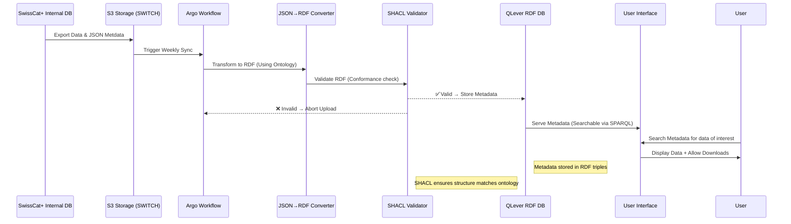

# Infrastructure overview

The different components documented here (ontology, converter and front-end), tie into a bigger Research Data Infrastructure. This RDI is deployed on kubernetes and also includes Databases and a Workflow Orchestrator (Argo), which runs the conversion automatically on new raw data and then uploads them to a Graph Database for RDF metadata.

A brief overview of the infrastructure flow is here: 

For more information, please contact SwissCat+ team or SDSC.